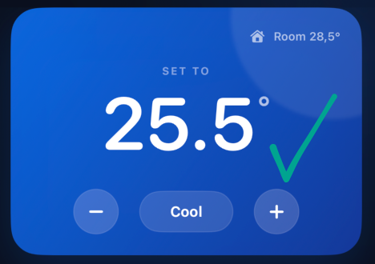
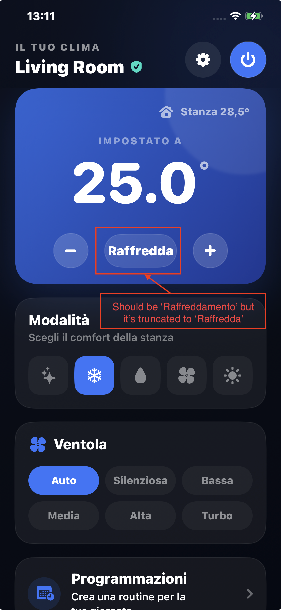
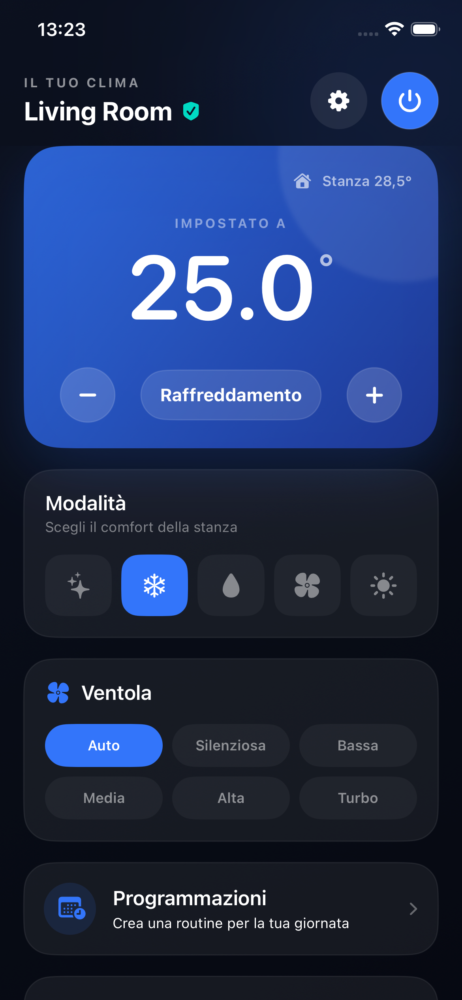
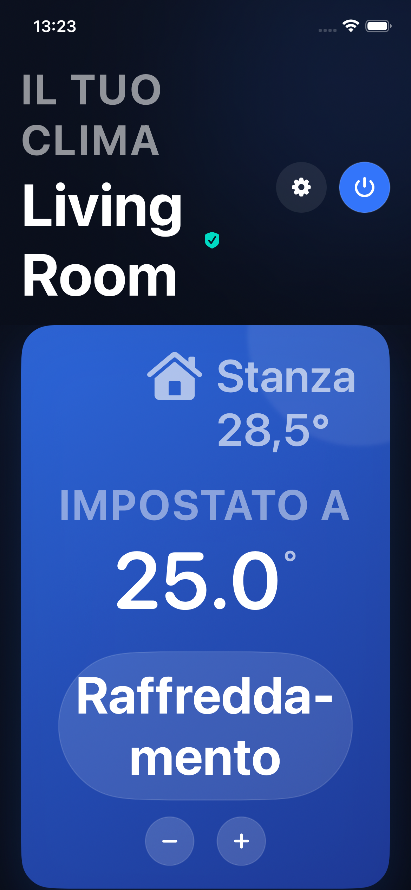

# Full mode names on iPhone

Related issue: #22. Pull request: #27.

Device testing on 2026-10-09 showed the English summary "Cool" correctly, while the Italian summary showed "Raffredda" instead of the requested full mode name "Raffreddamento". The existing Italian action translation was reused for the summary; the screenshot does not show an ellipsis.

The temperature card now has separate localized summary names. English retains Auto, Cool, Dry, Fan, Heat. Italian displays Automatico, Raffreddamento, Deumidificazione, Ventilazione, Riscaldamento. The icon-only mode buttons retain their existing accessibility labels.

The summary stays between the temperature buttons when its natural width fits. Otherwise it moves above them and can wrap at large text sizes. Text is not reduced or abbreviated to fit.

## User screenshots before the fix

## Regression coverage

The UI regression exercises all five modes in English and Italian at default and largest accessibility text size. It checks the full summary, selection, visibility, containment within the temperature card, and separation from the temperature buttons. Screenshots are retained for visual inspection, because accessibility labels alone cannot prove that rendered text is complete.

## Verified result

On the combined enhancement branch, all 20 mode/language/text-size cases passed on an iPhone 17e simulator. The existing mode-selector and status-badge regressions passed, as did all 37 package tests. The signed iPhone build succeeded using the existing manual profiles.

