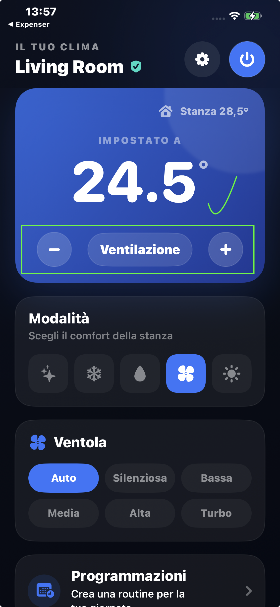
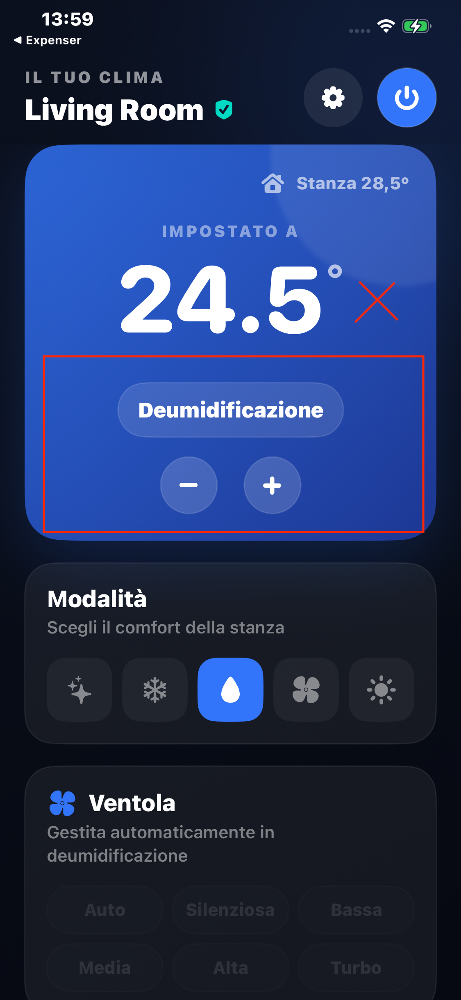
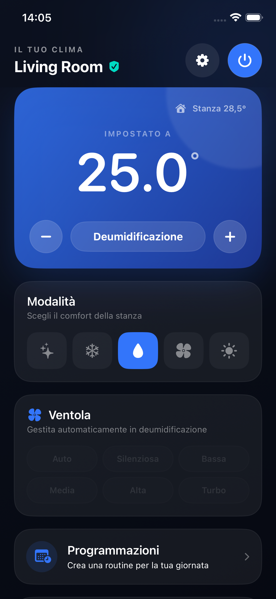
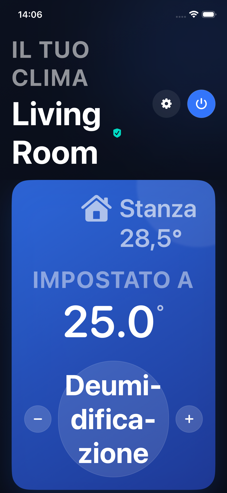

# Keep temperature controls inline

Issue #29 is a follow-up to #22 and PR #27. The user prefers the inline layout for Ventilazione and requests that longer names, including Deumidificazione, never move above the temperature buttons.

The iPhone temperature card now always uses a horizontal row with minus, full localized mode name, and plus. Reduced spacing and label padding give the summary more width. Normal text stays on one line with modest scaling when needed. At accessibility sizes the label can wrap inside the center space, with the buttons aligned alongside its center. Both buttons retain their 46-point size.

The mode-summary UI regression checks all five modes in English and Italian at normal and largest accessibility text size. In addition to full names and visibility, it checks the horizontal order, vertical alignment, no overlap, card containment, and minimum 44-point button targets.

## Verified result

All 20 mode/language/text-size combinations passed on a compact iPhone 17e simulator using the combined enhancements. All screenshots were visually inspected. The existing mode-selector and status-badge regressions also passed.

