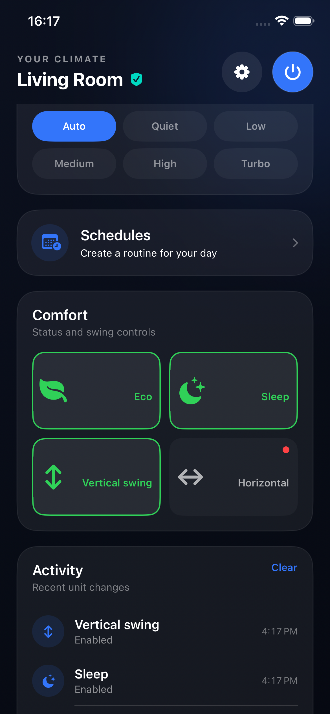
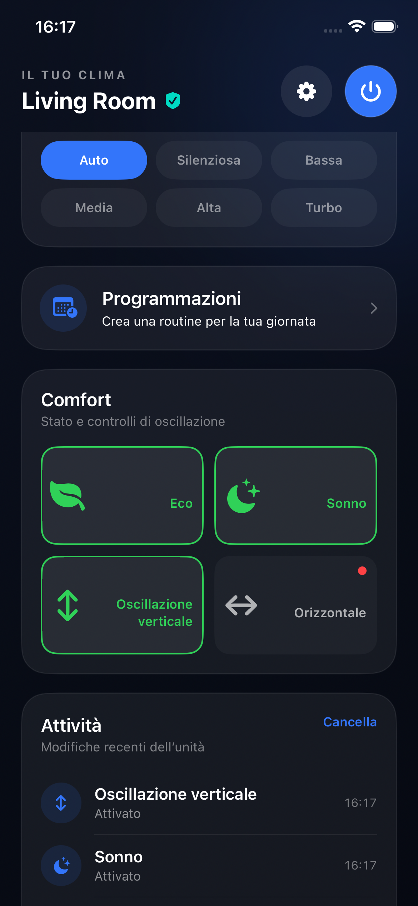
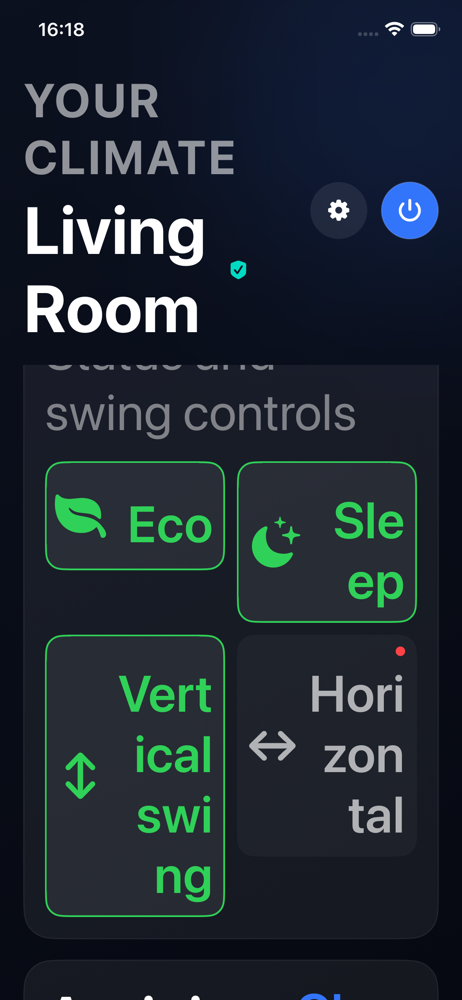
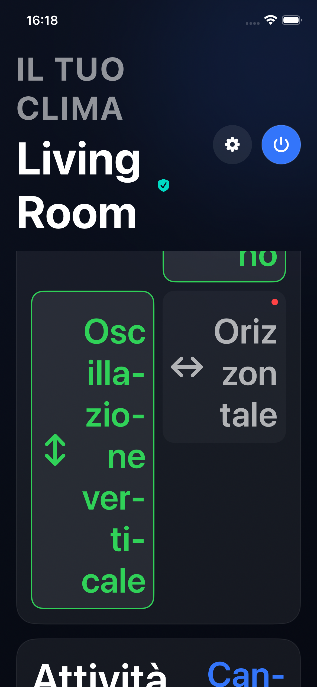

# Two Comfort cards per row

Issue #31 requests rectangular Comfort controls in two columns instead of a list.

The dashboard now always places Eco and Sleep in the first row, then Vertical swing and Horizontal in the second row. Both columns have equal width. Each card puts a larger icon on the left and its full localized label on the right, with trailing alignment. Text has no line limit and can wrap; the cards grow vertically and align at the top of their row.

Off controls display a red dot in the top-right corner, with reserved space so it cannot overlap the text. On controls hide the dot and display a green outline. The screenshots below show the revised layout requested during device testing.

Verified on an iPhone 17e simulator running iOS 26.5. Three UI regressions passed with no failures. The Comfort regression checks English and Italian at default and largest accessibility text sizes, exact labels, rendered-text containment, equal column widths, row alignment, separation, minimum target height, and all four toggle actions. The other regressions verify Dry-mode and powered-off availability. All 37 Swift package tests passed.

The retained screenshots were visually inspected for complete rendered Comfort labels. At the largest size, long words wrap across multiple lines and the section scrolls vertically.

## Default text size

## Largest accessibility text size

