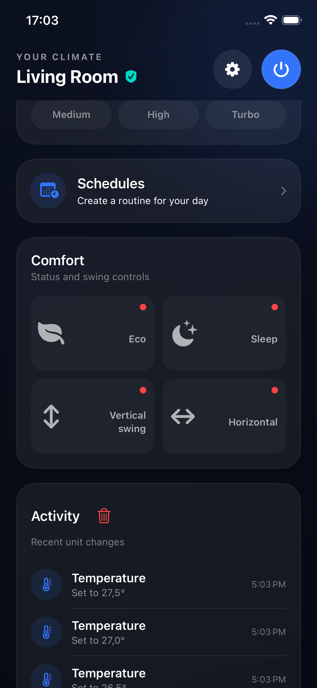
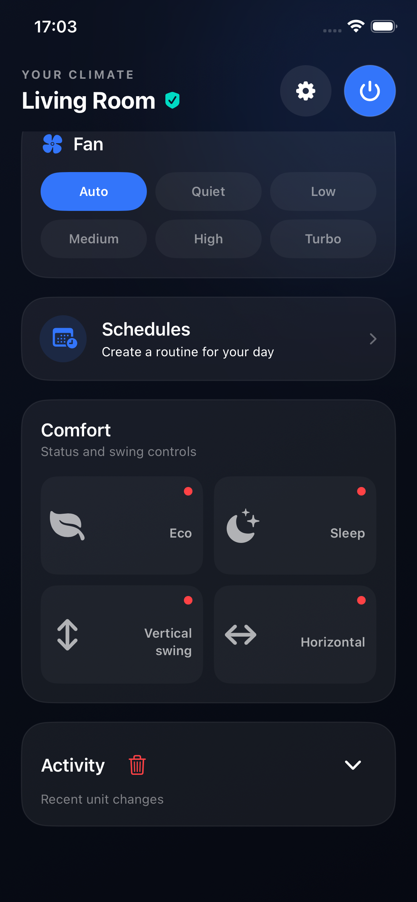
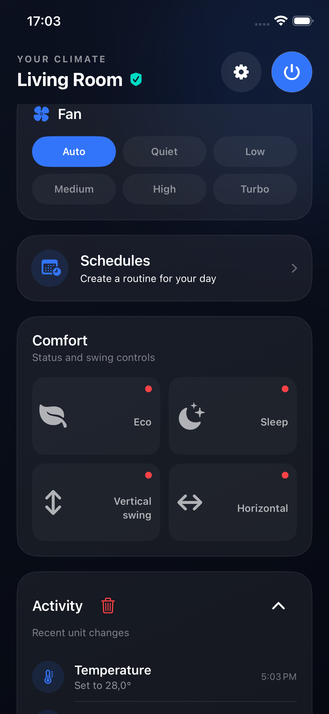

# Activity history and sixth-entry collapse

Issue #33 keeps all Activity entries visible while there are at most five. Recording a sixth change automatically hides every row and shows the closed chevron at the far right of the header. Tapping that chevron reveals the full newest-first history; tapping it again hides every row.

A red trash icon sits immediately beside Activity/Attività. It replaces the visible Clear/Cancella text, retains the localized accessibility label, and clears the history independently. Clearing resets expansion and removes the chevron. The empty state and 50-entry retention limit remain.

English and Italian UI checks on iPhone 17e / iOS 26.5 verify five visible entries with no chevron, automatic collapse when the sixth arrives, six rows on expansion, zero rows after collapse, and clearing while expanded. The existing clear-history regression also passes. Both icon buttons have at least 44-point tap targets.

