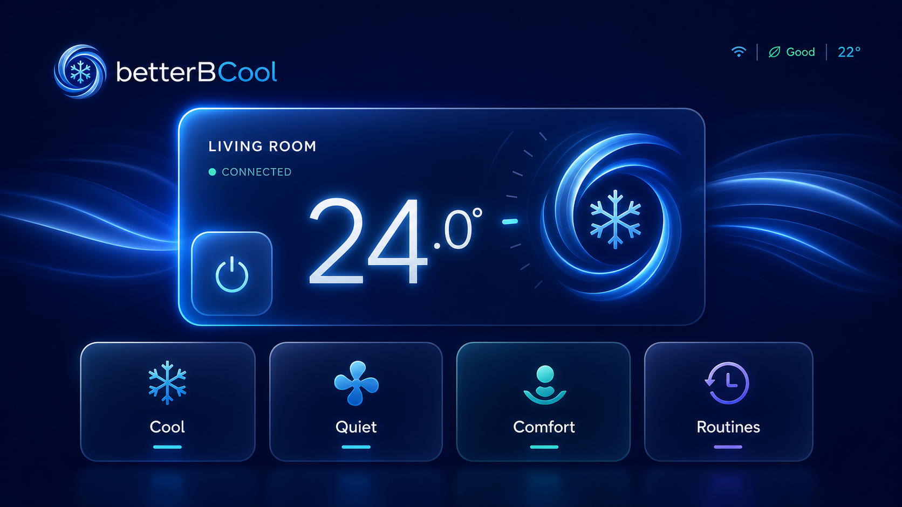

# betterBCool for tvOS — product and implementation plan

Status: proposed
Prepared: 2026-08-16
Recommended app target: tvOS 26, SwiftUI
Estimated delivery: 4–6 weeks for one experienced Swift engineer, including backend pairing and release polish



> This image is a generated visual-direction concept, not a screen to ship verbatim. Production UI should use native SwiftUI controls, SF Symbols, system focus effects, and deterministic artwork.

## 1. Product goal

Build a first-class Apple TV companion that exposes the iPhone app's useful climate controls from across the room while feeling native to tvOS. The TV app should be fast enough for a power or setpoint change in a few remote clicks, visually rich enough to belong on the Apple TV Home Screen, and safe enough that it never exposes Bosch credentials or performs an ambiguous command.

The first public release should provide:

- live state for the selected air conditioner;
- power, setpoint, mode, fan, Eco, Sleep, and vertical/horizontal swing controls;
- routine browsing, enable/disable, and template-based creation/editing;
- recent confirmed activity;
- an optional read-only wrist-temperature summary synced from the phone;
- interactive demo mode before pairing;
- a phone-assisted pairing flow with no password entry on the TV;
- a layered parallax app icon and Top Shelf artwork.

The TV app is not a stretched phone layout. It is a ten-foot interface with one prominent climate hero, a small number of large focusable actions, and detail screens for less frequent work.

## 2. What can be reused today

The repository is already structured well for a new platform:

- `BetterBCoolCore` owns the transport-neutral `ClimateService`, state, capabilities, validation, schedules, demo service, and cloud service.
- The existing phone dashboard proves the control rules and optimistic-update behavior.
- The backend already serializes Bosch token refreshes and executes durable routines.
- Demo mode provides deterministic data for tvOS UI work and App Review.
- Existing English, German, Spanish, French, and Italian localizations can seed the TV strings.

Work that should **not** be shared directly:

- `ClimateDashboard` is a vertical, touch-first iPhone view. Reusing it would produce weak focus navigation and poor ten-foot hierarchy.
- The iOS composition root imports UIKit, AuthenticationServices, HealthKit-facing state, and iPhone settings. tvOS needs its own composition root.
- The iPhone activity log is process-local. A cross-device log needs backend storage.
- tvOS cannot be the HealthKit source for wrist temperature. The phone must remain the source and automation owner.

Recommended source layout:

```text
TVApp/                         tvOS app target, composition root, assets, pairing
Sources/BetterBCoolTVUI/       tvOS-only screens, focus components, TV view models
Sources/BetterBCoolCore/       shared climate and schedule domain code
backend/app/api/tv/            pairing, scoped TV sessions, activity and wrist summary
TVTests/                       TV view-model and serialization tests
TVUITests/                     Siri Remote focus and end-to-end demo tests
```

Add `.tvOS(.v17)` to the Swift package platform list so the shared packages remain broadly compilable, while setting the first app target's deployment target to tvOS 26. That matches the repository's Xcode 26 toolchain and allows the production UI to adopt the current visual system without maintaining two substantially different presentations.

## 3. Recommended connection architecture

Use **cloud-paired live control** for the production TV app:

```text
iPhone betterBCool ── approves one-time code ──┐
                                               ▼
Apple TV ── scoped TV session ──► betterBCool Cloud ──► Bosch PointT or Bacon
                                      │
                                      ├─ durable routines
                                      ├─ confirmed activity
                                      └─ optional wrist summary
```

This keeps Bosch refresh tokens in one authority, prevents the phone and TV from racing to rotate them, works while the phone is asleep, and avoids typing Bosch credentials with the Siri Remote. It also follows Apple's recommendation to use another device for tvOS authentication and minimize text entry.

### Pairing flow

1. On first launch, the TV offers **Try Demo** and **Connect with iPhone**.
2. `POST /api/tv/pair/start` creates a ten-minute pairing session and returns a short display code, a QR/deep link, and an unguessable polling secret.
3. The TV shows the code and QR. The QR opens a new **Connect Apple TV** screen in the iPhone app.
4. The signed-in iPhone approves the code using its existing cloud credentials and installation ID. The TV never sees the backend master API key or Bosch tokens.
5. The TV exchanges the approved session for a random, per-TV bearer token and stores it in the tvOS Keychain.
6. The iPhone lists paired TVs and can rename or revoke each one.

Backend tables:

- `tv_pairing_sessions`: code hash, polling-secret hash, expiry, approval state, installation ID;
- `tv_devices`: installation ID, device ID/name, token hash, scopes, created/last-used/revoked timestamps;
- `activity_events`: installation ID, confirmed state change, source, timestamp, capped retention;
- `wrist_summaries`: optional encrypted-or-minimized display snapshot, timestamp, consent flag.

Security requirements:

- never put the cloud API key, Bosch token, installation ID, or bearer token in the QR payload;
- hash TV session tokens at rest, rate-limit pairing attempts, expire codes, and make approvals one-use;
- scope TV tokens to climate read/write, routines, activity, and optional wrist-summary access;
- require a fresh authoritative state read after every live write, as the phone already does;
- allow immediate revocation from the iPhone and clear the TV Keychain on sign-out;
- keep demo mode completely local and network-free.

If a cloud-free TV app becomes a requirement, schedule a separate protocol spike before committing to it. Copying Bosch refresh credentials to the TV or relaying through a sometimes-offline iPhone would weaken the current single-token-authority model.

## 4. Information architecture

### Home

The launch screen is a single-screen control surface:

- brand and selected room at the top;
- connection freshness and room temperature as secondary status;
- one large climate hero showing power, setpoint, and operating mode;
- a first row for Temperature, Mode, Fan, and Power;
- a second row for Comfort, Routines, Activity, and Settings when needed;
- transient toast/banner for confirmed changes or recoverable errors.

The initially focused control should be the temperature hero, not Power, to reduce accidental toggles. Clicking the hero opens a focused temperature stepper with explicit minus and plus actions. Do not repurpose Play/Pause or invent remote gestures for climate commands.

### Mode and fan

Use one horizontal shelf of large lockups. Unsupported values remain visible only when an explanation is useful; otherwise omit them so the focus engine never lands on dead controls. Dry mode should explain that the fan is managed automatically.

### Comfort

Present Eco, Sleep, vertical swing, and horizontal swing as a 2×2 grid with clear on/off states. A press changes one value, shows a pending state, then settles on the confirmed device response or restores the previous value on failure.

### Routines

Release 1 should support full functional parity without forcing phone-style data entry:

- browse routines and see next run, weekday summary, step count, and enabled state;
- enable/disable or run a routine;
- create from **Night comfort** or **Start from scratch**;
- edit start time, weekdays, and climate steps using pickers and cards;
- rename through the system keyboard only when requested.

Keep the editor progressive: Routine → Days and time → Steps → Review. Preserve the existing schedule model and validation.

### Activity

Show the 20 most recent confirmed changes, including source such as Apple TV, iPhone, routine, or wrist automation. **Clear on this TV** should clear the local presentation; a separate, clearly worded **Delete shared history** action belongs in Settings and requires confirmation.

### Wrist temperature

The TV shows this only after explicit opt-in on the iPhone. Display the latest value, baseline, deviation, and freshness as read-only context. Never imply continuous body temperature or a medical purpose. The iPhone/backend remains responsible for authorization and automation decisions.

### Settings

Keep settings short: selected unit, paired-account status, TV name, temperature unit, wrist-summary visibility, reduce-animation option, diagnostics, privacy/safety, and disconnect. Cloud URL/API-key fields remain debug-only; production pairing must not expose secrets on a shared television.

## 5. Visual system

The visual direction should evolve the current app rather than replace it:

- midnight navy background with very slow, low-contrast airflow ribbons;
- cool-blue hero gradient while on and restrained deep red while off;
- mint for healthy/connected state and amber for stale or recoverable state;
- large rounded numerals for the setpoint;
- standard materials for content cards;
- Liquid Glass primarily for navigation and transient controls, not on every card;
- native system focus lift, highlight, and gimbal/parallax wherever possible;
- motion that communicates state, never a constant light show.

Focus treatment for a lockup:

- approximately 1.04–1.08 scale depending on card size;
- brighter edge and shadow, slight content parallax, and elevated z-position;
- at least enough neighboring space that the focused card never collides or clips;
- 150–220 ms spring-like response, disabled or simplified for Reduce Motion;
- no color-only indication: combine scale, luminance, and shape.

Use tvOS-readable typography. Apple's current accessibility guidance gives 29 pt as the platform default and 23 pt as the minimum for custom text; treat 23 pt as a floor for secondary information, not a target for primary controls. Respect safe-area insets and test both 1080p and 4K output instead of baking overscan assumptions into constants.

## 6. Asset plan

### Already created

- `docs/assets/tvos-dashboard-concept.png` — 16:9 design-direction reference for hierarchy, palette, and focus glow. It is documentation-only.

### Production assets to create during implementation

1. **Layered tvOS app icon**
   - Use Xcode's tvOS image stack.
   - Supply 2–5 unmasked rectangular layers; four are recommended: navy base, airflow ribbons, snowflake/dial, and specular highlights.
   - Author the master at the current 800×480 tvOS layout size, then fill every Xcode-required variant and inspect it in the parallax preview.
   - Keep the brand mark inside a generous safe zone because foreground layers crop more while focused.

2. **Top Shelf art**
   - Ship a static brand image first; the documented standard slot is 1920×720, with the matching high-resolution variant requested by the asset catalog.
   - Use atmospheric airflow and the mark, with no private climate data on the shared Home Screen.
   - Consider an opt-in dynamic Top Shelf extension only after release. If added, it can deep-link to Home or Routines, but should default to generic artwork.

3. **In-app backdrop**
   - Prefer a deterministic SwiftUI gradient and lightweight vector/raster airflow layer over a large generated full-screen bitmap.
   - Provide a static fallback for Reduce Motion and low-power rendering.

4. **Store media**
   - Capture real simulator/device UI at 3840×2160 after the interface is final.
   - Prepare 4–6 screenshots: Home hero, mode/fan, comfort, routines, and demo/pairing.
   - Optionally record a short app preview only after focus navigation is stable.

Do not generate SF Symbols, text-heavy controls, or final screenshots. Those should come from the shipping UI so they remain crisp, localizable, and truthful.

## 7. Delivery phases

### Phase 0 — decisions and pairing contract (2–4 days)

- Confirm tvOS 26 as the deployment target and cloud pairing as the release architecture.
- Write the pairing/session API schemas and threat model.
- Prototype code/QR approval end to end with fake installation data.
- Define activity retention and wrist-summary consent.

Exit criterion: a demo TV client can pair, receive a scoped token, revoke it, and cannot access another installation.

### Phase 1 — target and shared-core readiness (2–3 days)

- Add `BetterBCoolTV` and TV UI/test targets to the Xcode project.
- Add tvOS to `Package.swift` and resolve platform conditionals.
- Create a tvOS composition root using `DemoClimateService` first.
- Add a TV-specific `ClimateViewModel` that keeps the phone's optimistic-update/reconciliation semantics.
- Add deterministic preview fixtures for on, off, read-only, stale, loading, and error states.

Exit criterion: the demo app launches in the tvOS simulator and all shared unit tests still pass.

### Phase 2 — dashboard MVP (5–7 days)

- Build Home, temperature, mode, fan, power, and comfort controls.
- Define focus scopes, default focus, back behavior, loading, pending, and error presentation.
- Connect to the existing cloud climate read/apply endpoints through the scoped TV session.
- Add 10–15 second foreground polling plus immediate refresh after writes; suspend polling while backgrounded.
- Add UI tests that traverse every focusable control without trapping or skipping.

Exit criterion: every common control works in demo and live cloud modes with authoritative reconciliation.

### Phase 3 — feature parity (5–8 days)

- Add routines list, toggles, run action, and progressive editor.
- Add shared activity events with local fallback.
- Add opt-in wrist summary sync and read-only card.
- Add settings, paired-device revoke flow on iPhone, localization, and disconnect behavior.

Exit criterion: the parity matrix below is complete and privacy settings work from both devices.

### Phase 4 — tvOS visual polish and assets (3–5 days)

- Implement final background, materials, focus motion, transitions, and subtle state animation.
- Produce and validate the layered app icon and Top Shelf artwork.
- Test Reduce Motion, Reduce Transparency, Increase Contrast, VoiceOver, and larger text.
- Capture real 4K App Store screenshots.

Exit criterion: no clipped focus effects, unreadable text, hidden controls, or constant distracting motion.

### Phase 5 — verification and release (4–6 days)

- Test on the oldest supported Apple TV and a current Apple TV 4K, not just Simulator.
- Exercise remote, game controller, keyboard, 1080p/4K, slow/offline network, expired/revoked sessions, read-only devices, and stale Bosch state.
- Run Swift tests, backend tests/typecheck/build, tvOS UI tests, and an App Store archive.
- Update README, privacy policy, support copy, safety notes, and App Store metadata.

Exit criterion: a clean install can try demo, pair, control, recover from failure, disconnect, and pass App Review without hidden setup knowledge.

## 8. Feature parity matrix

| iPhone feature | tvOS release behavior | Phase |
| --- | --- | --- |
| Live state and refresh | Full parity, automatic refresh plus manual retry | 2 |
| Power and setpoint | Full parity with explicit focusable controls | 2 |
| Mode and fan | Full parity, capability-filtered | 2 |
| Eco, Sleep, swing | Full parity in Comfort grid | 2 |
| Recurring routines | Browse, toggle, run, create, and edit | 3 |
| Activity log | Shared confirmed log with source labels | 3 |
| Wrist-temperature display | Opt-in, read-only phone-synced summary | 3 |
| Wrist cooling automation | Status only; phone/backend remains owner | 3 |
| Bosch sign-in | Replaced by phone-assisted pairing | 0/3 |
| Demo mode | Full parity, available before pairing | 1 |
| Multi-unit selection | Show the current unit; add selector when core product supports it | Later |

## 9. Test plan and quality gates

Automated:

- core validation and schedule tests run on tvOS-compatible code;
- pairing replay, expiry, brute-force/rate-limit, revocation, and cross-installation isolation tests;
- TV view-model tests for optimistic updates, rollback, capability filtering, and stale responses;
- focus-path UI tests for every screen and Back-button path;
- screenshot tests for on/off, long localization, read-only, offline, and accessibility variants.

Manual:

- sit 2–4 metres from the display and verify every label and state change;
- hand the remote to someone unfamiliar with the app and ask them to set 24°, choose Quiet fan, and enable a routine;
- confirm focused cards remain sharp and unclipped while moving rapidly;
- verify no sensitive identifiers appear in logs, QR codes, Top Shelf, screenshots, or diagnostics;
- compare live changes with the official app and keep commands within reported capabilities.

Performance budgets:

- useful cached/demo UI visible in under one second;
- focus response stays immediate with no network work on the main actor;
- live state normally visible within two seconds of foregrounding on a healthy connection;
- command pending state appears immediately and resolves or errors within the existing 30-second network timeout;
- background visuals sustain 60 fps on the oldest supported device and stop or simplify under Reduce Motion.

## 10. Definition of done

The tvOS app is ready when:

- all parity items above are implemented or explicitly gated behind phone-only ownership for platform/privacy reasons;
- every value is validated through `ClimateCapabilities` before sending;
- every live write is reconciled with authoritative state and recorded only after confirmation;
- pairing is one-use, scoped, revocable, rate-limited, and free of reusable secrets on screen;
- the full app is operable with the Siri Remote and VoiceOver without focus traps;
- layered icon, Top Shelf art, localizations, privacy copy, and 4K screenshots are complete;
- demo, offline, stale, read-only, expired-session, and revoked-session states are polished;
- unit, backend, UI, accessibility, device, and archive checks pass.

## 11. Platform references

- [Apple: Designing for tvOS](https://developer.apple.com/design/Human-Interface-Guidelines/designing-for-tvos)
- [Apple: Focus and selection](https://developer.apple.com/design/human-interface-guidelines/focus-and-selection/)
- [Apple: Remotes](https://developer.apple.com/design/human-interface-guidelines/remotes)
- [Apple: Managing accounts](https://developer.apple.com/design/human-interface-guidelines/managing-accounts)
- [Apple: App icons](https://developer.apple.com/design/human-interface-guidelines/app-icons)
- [Apple: Configuring an app icon in an asset catalog](https://developer.apple.com/documentation/xcode/configuring-your-app-icon)
- [Apple: TVTopShelfContentProvider](https://developer.apple.com/documentation/tvservices/tvtopshelfcontentprovider)
- [Apple: SwiftUI focus](https://developer.apple.com/documentation/swiftui/focus)
- [Apple: Accessibility](https://developer.apple.com/design/human-interface-guidelines/accessibility/)
- [Apple: Apple TV screenshot specifications](https://developer.apple.com/help/app-store-connect/reference/app-information/screenshot-specifications)

## Appendix — concept-generation record

The documentation concept was generated with the built-in image-generation tool using the existing app icon as a brand/color reference. The essential prompt was:

> Create a polished 16:9 Apple tvOS dashboard concept for betterBCool using the existing luminous icy-blue and deep-navy brand language. Show a large Living Room climate hero with 24.0°, connected state, power, and large focusable cards for Cool, Quiet, Comfort, and Routines. Use generous safe margins, native tvOS hierarchy, glass materials, subtle parallax depth, and one clearly focused card. Avoid phone framing, tiny text, people, physical TV hardware, third-party logos, and excessive neon.
